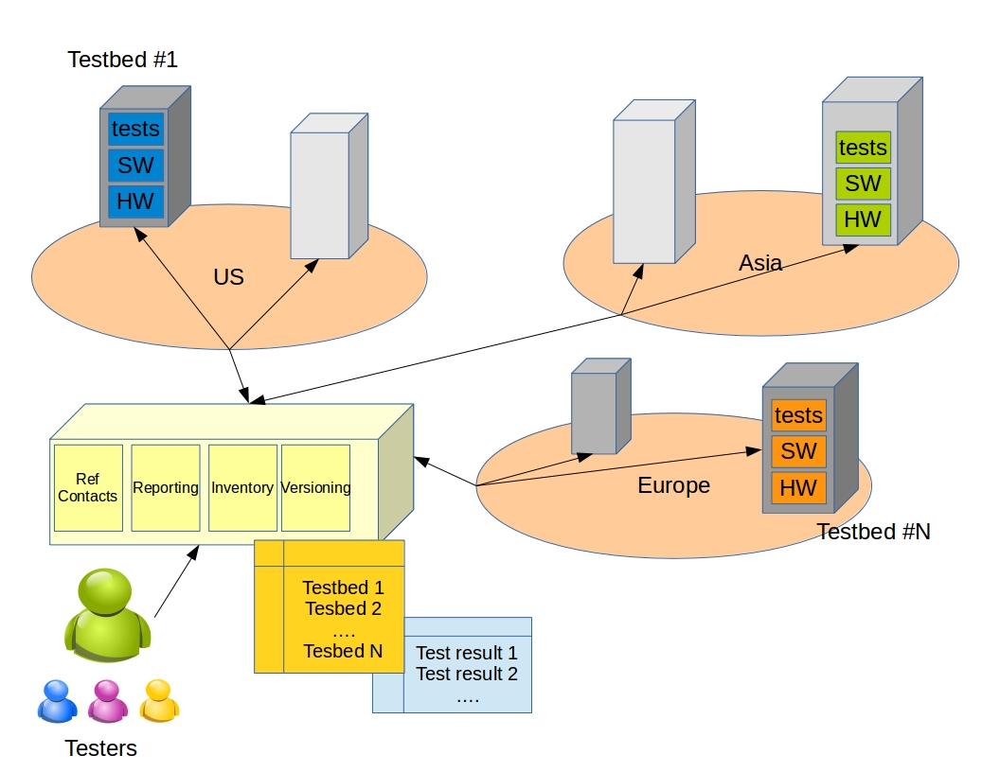

#########################################
Project: Testbed infrastructure (Pharos) 
#########################################

The Pharos project deals with the creation of a distributed and federated NFV test capability that will be hosted by a number of companies in the OPNFV community. The goals consist in managing the list of community platforms, describing the different community platforms, offering timeslots and tools to perform tests, sharing the results and the best practices, supporting any test campaigns of the projects of the community (e.g. [[opnfv_functional_testing | functional testing project]], [[platform_performance_benchmarking|Qtip]], [[get_started|BGS]], [[oscar/project_proposal|oscar]],...). Pharos shall provide the infrastructure and the tooling needed by the different projects.

Community Test Labs
===================

A summary of all Community Hosted OPNFV test labs (existing and planned) is also kept on the [[start#opnfv_community_labs|wiki home page]]. This section here contains additional details and project relationship mappings.  //NOTE: Please follow [[lab_update_guide|these instructions]] when updating this list.//

<olmap id="olMapOne" width="877px" height="200px" lat="45.0" lon="0.0" zoom="3" statusbar="1" toolbar="1" controls="1" poihoverstyle="0" baselyr="OpenStreetMap" gpxfile="" kmlfile="">

37.333685,-121.891272,60,.8,marker-green.png,[[pharos/spirentvctlab|Spirent VCT Lab]] \\ San Jose, California
39.90,116.35,60,.8,marker-red.png,China Mobile Labs;Beijing, China \\ external link: [[http://www.test.com|test.com]]
45.50,-73.66,60,.8,marker-blue.png,Ericsson Labs;Montreal, Canada \\ external link: [[http://www.test.com|test.com]]
34.26,108.97,60,.8,marker-green.png, Huawei Labs;Xi an, China \\ external link: [[http://www.test.com|test.com]]
45.53,-122.97,60,.8,marker-green.png,Intel Labs;Hillsboro, Oregon \\ link: [[https://wiki.opnfv.org/get_started/intel_hosting|intel_hosting]]
48.75867,-3.45196,60,.8,marker-gold.png,Orange Labs;Lannion, France \\ external link: [[http://www.test.com|test.com]]
48.82,2.27,60,.8,marker-gold.png,Orange Labs;Paris, France \\
[[http://www.test.com|test.com]] \\ internal link: [[http://www.test.com|test.com]] - [[::start]] \\ **DW Formatting** 
</olmap>

^ Map Position ^ Hosting Organization  ^ Home page  ^ Contact person  ^ Comments     ^ Location    ^
|1|Spirent|[[pharos/spirentvctlab|spirentvctlab]]|Iben Rodriguez <iben.rodriguez@spirent.com>| OpenDaylight, NFV, SDN, & OpenStack testing in progress | [[http://www.nephoscale.com|Nephoscale]] San Jose, CA |
|2| China Mobile |  |Fu Qiao <fuqiao@chinamobile.com>| PODs dedicated for BGS and Functest | Beijing, China|
|3| Ericsson | [[get_started/ericsson_hosting|ericsson_hosting]] |Jonas Bjurel <jonas.bjurel@ericsson.com>| |Montreal, Canada|
|4| Huawei | |Radoaca Vasile <radoaca.vasile@huawei.com>| TBD |Xi an, China|
|5| Intel | [[get_started/intel_hosting|intel_hosting]]|Trevor Cooper <trevor.cooper@intel.com>|Operational with PODs dedicated to BGS and vSwitch projects|Intel Labs; Hillsboro, Oregon|
|6| Orange | |Morgan Richomme <morgan.richomme@orange.com>|Available Q1 2015|Orange Labs; Lannion, France|
|7| Orange | |Morgan Richomme <morgan.richomme@orange.com>|Available Q1 2015|Orange Labs; Paris, France|
|8| Cable Labs | | | TBD | |
|9| Dell | |Wenjing Chu <Wenjing_Chu@DELL.com>| TBD |Santa Clara, CA|
|10| Huawei | |Sean Chen <s.chen@huawei.com>|TBD|Santa Clara, CA|

----

Pharos management
==================

  * [[opnfv_testbed_infrastructure|Project proposal]]
  * A "Pharos compliant" environment is the [[pharos/pharos_specification|standard configuration of a deployed system]] for test purposes
  * [[pharos_testing|Testing]] on "Pharos compliant" environment 
  * [[pharos_draft_release|Project draft release]]
  * [[pharos_tasks|Task follow-up]]
  * [[pharos_faq|FAQ]]
  * [[wiki/test_and_performance_meetings|meeting & minutes page]] <- this page needs to be moved and renamed

Pharos project - Key facts
==========================

** Project Creation Date: ** January 8, 2015 \\
** Project Category: ** Integration & Testing\\
** Lifecycle State: ** Incubation \\
** Primary Contact: ** Trevor  <trevor.cooper@intel.com> \\
** Project Lead: ** Trevor  <trevor.cooper@intel.com> \\
** Jira Project Name: ** Testbed infrastructure Project\\
** Jira Project Prefix:  PHAROS ** \\
** Committers: ** 
    * Trevor Cooper<trevor.cooper@intel.com>
    * Fu Qiao <fuqiao@chinamobile.com>
    * Sheng-ann Yu <sheng-ann.yu@ericsson.com>
    * Wenjing Chu <Wenjing_Chu@DELL.com>
    * Chris Donley <C.Donley@cablelabs.com>
    * Morgan Richomme <morgan.richomme@orange.com>
    * Erica Johnson <erica.johnson@iol.unh.edu>
    * Hui Deng <denghui@chinamobile.com>
    * Prabu Kuppuswamy <prabu.kuppuswamy@spirent.com>
    * Sean Chen <s.chen@huawei.com>
    * Saikrishna M Kotha <saikrishna.kotha@xilinx.com>
    * Eugene Yu <yuyijun@huawei.com>

** Contributors: ** 
    * Iben Rodriguez <iben.rodriguez@spirent.com>

** IRC ** : freenode.net #opnfv-pharos ([[http://webchat.freenode.net/?channels=opnfv-pharos]])\\
** Mailing List ** : no dedicated mailing list - use opnfv-tech-discuss and tag your emails with [Pharos] in the subject for easier filtering \\
** Meetings ** : 
  * [[https://wiki.opnfv.org/wiki/test_and_performance_meetings| meetings]]
                
** Repository: ** pharos

Project calendar
=================
{{cal>namespace}}

----
